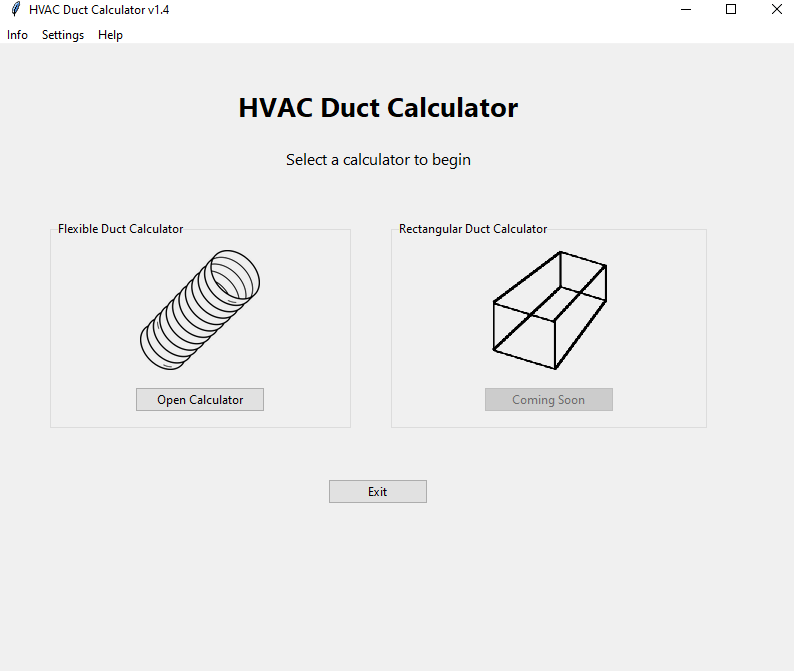
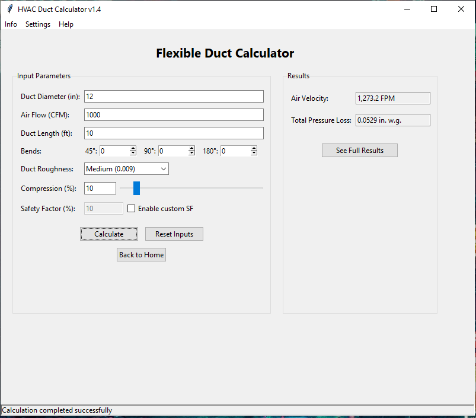
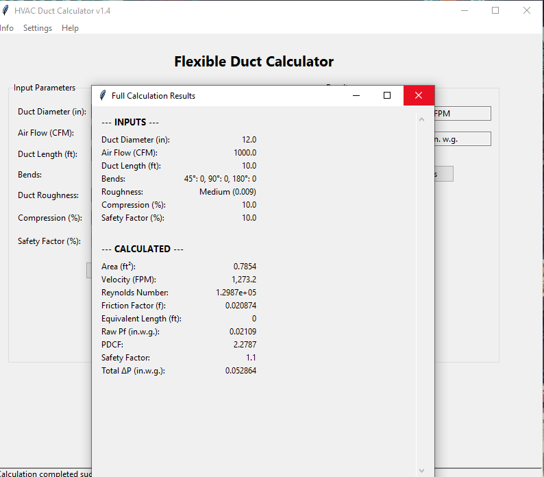

# HVAC Duct Calculator v1.4
<div align="center">
  
  
  
</div>

A lightweight Python GUI tool for calculating air velocity and pressure loss in HVAC flexible duct systems.

## ✨ Key Features
- **Flexible duct calculations** (rectangular duct support planned)
- **Real-time results**: Air velocity (FPM) & pressure loss (in.w.g.)
- **Input validation** and safety factor customization
- **Detailed results popup** with full calculation breakdown
- **User-friendly Tkinter interface**

## 📥 Quick Download
Ready-to-use EXE file available in the `app/` folder - no installation required!

## 📚 Documentation
All calculation equations, formulas, and engineering references are documented in the `docs/` folder.

## ⚙️ For Developers
```bash
# Run from source
pip install pillow
python app.py

# Project structure:
# app.py (main)
# core/calculations.py (logic)
# ui/ (GUI pages)
# assets/ (images)
👤 Credits
Engineer Bashar
basharwmn@gmail.com
© All rights reserved